

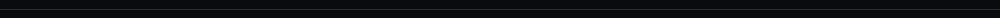

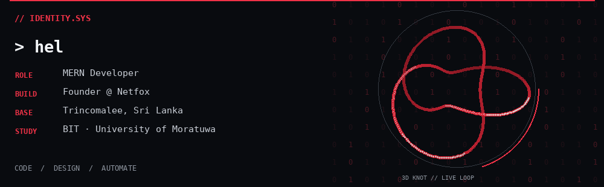

<a href="https://netfox-digital.vercel.app/">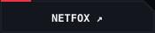</a>
<a href="https://www.linkedin.com/in/ravirajan-sinthujan/">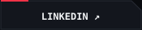</a>
<a href="mailto:ravirajan.sinthujan.official@gmail.com">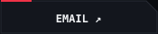</a>
<a href="https://www.instagram.com/sinthujan_dev/">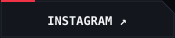</a>

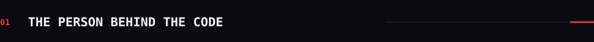

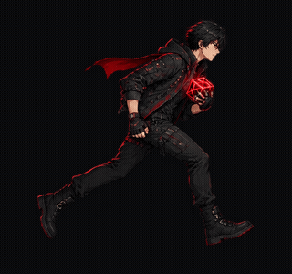 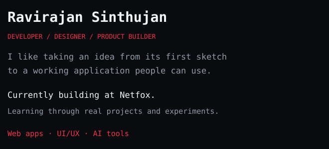

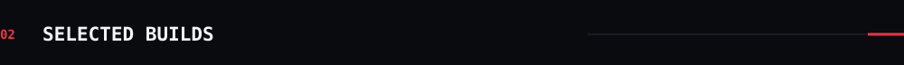

<a href="https://github.com/SinthujanCoder/LMS">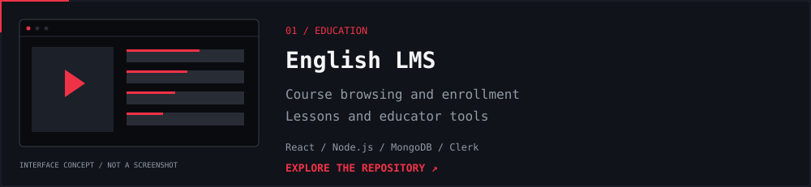</a>

<a href="https://github.com/SinthujanCoder/prescripto-full-stack">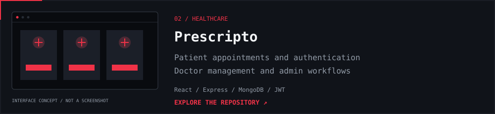</a>

<a href="https://github.com/SinthujanCoder/trinco-diving-center">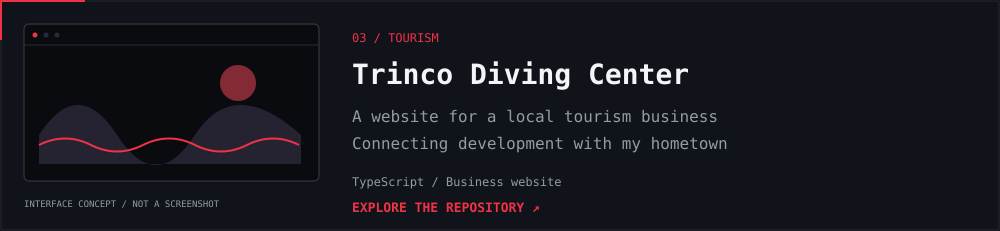</a>

<a href="https://github.com/SinthujanCoder/Doctor-Appointment-system">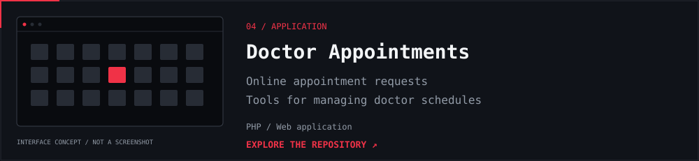</a>

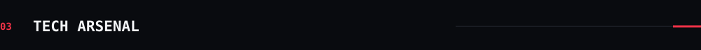

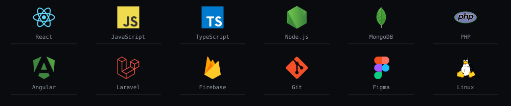

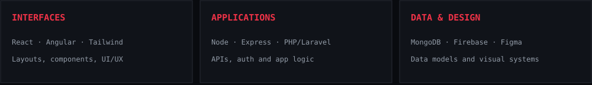

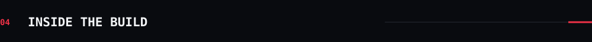

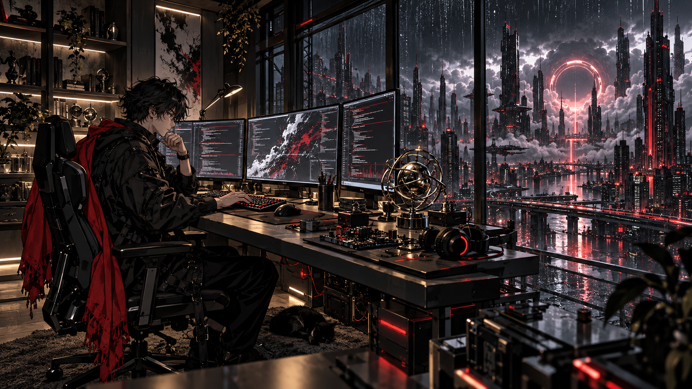

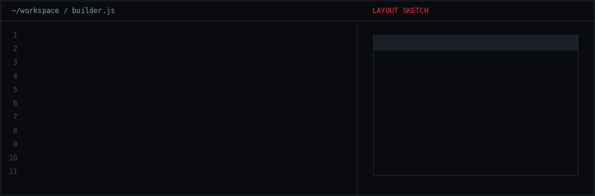

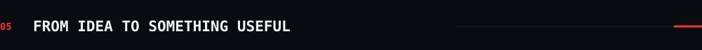

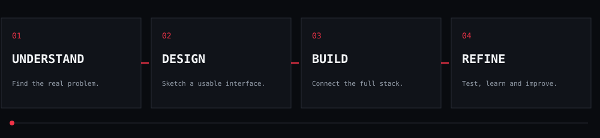

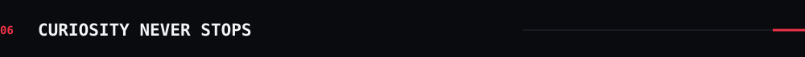

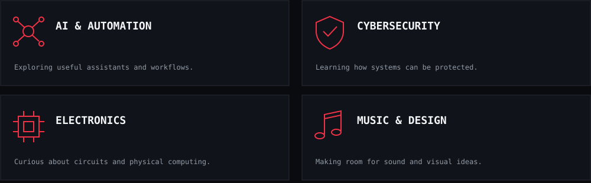

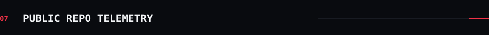

Contribution calendar ↗

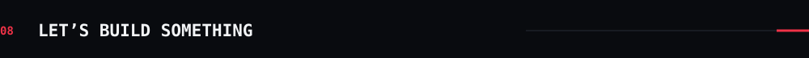

<a href="mailto:ravirajan.sinthujan.official@gmail.com">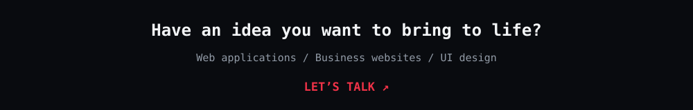</a>

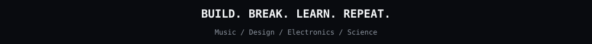

