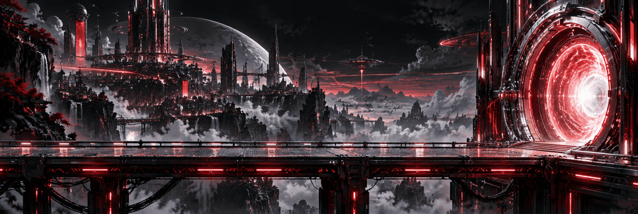
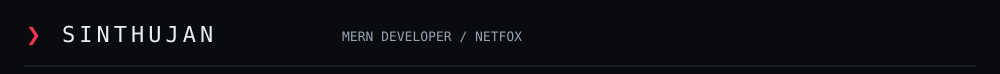
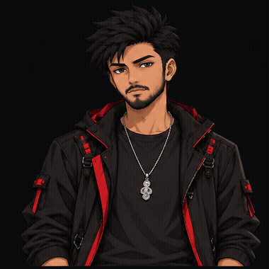
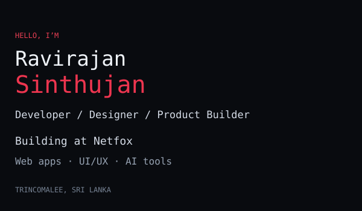
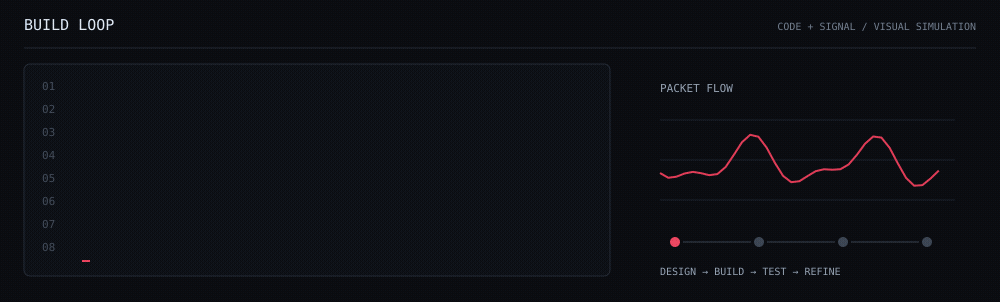
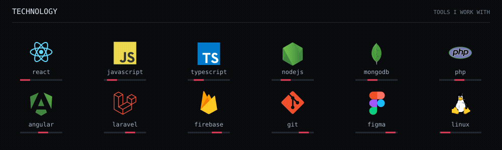
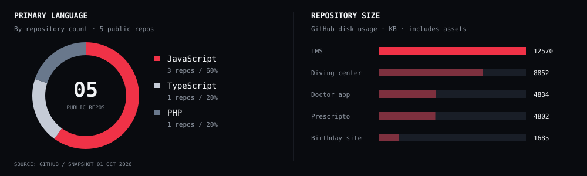
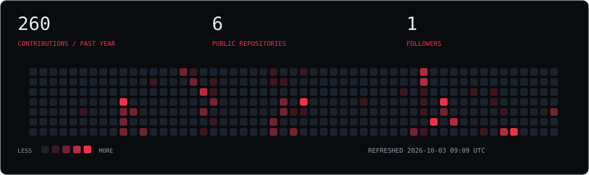
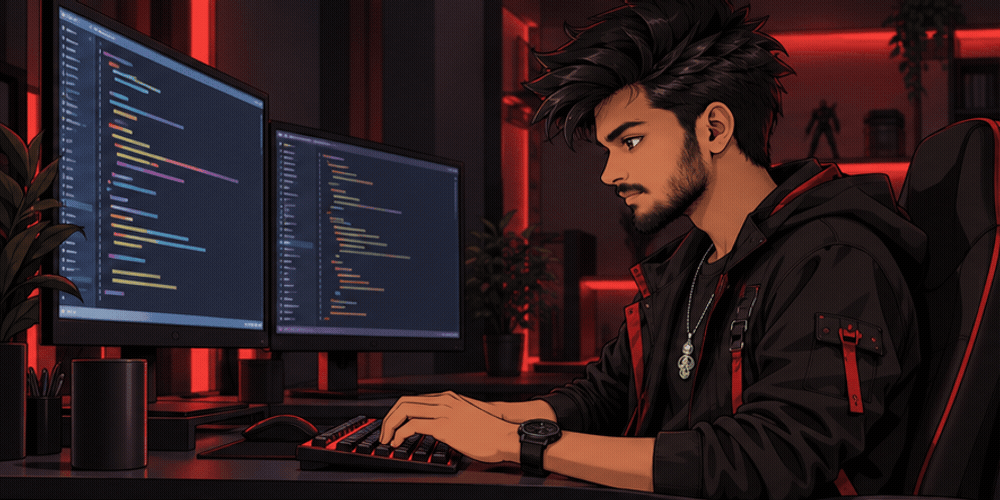
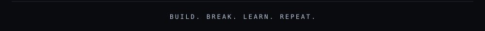

 

<a href="https://netfox-digital.vercel.app/">NETFOX</a> · <a href="https://www.linkedin.com/in/ravirajan-sinthujan/">LINKEDIN</a> · <a href="mailto:ravirajan.sinthujan.official@gmail.com">CONTACT</a>

Contribution calendar

